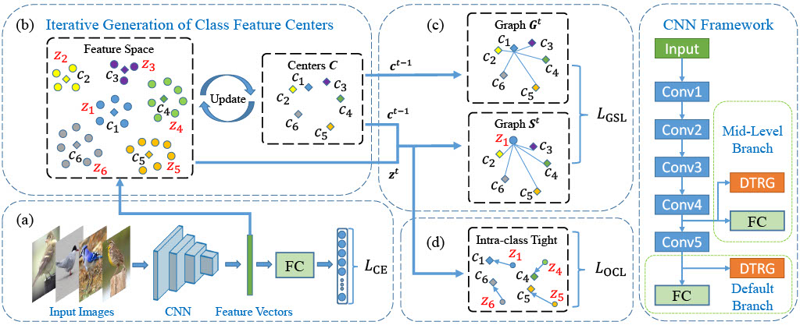
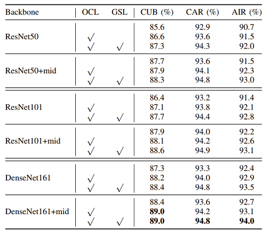
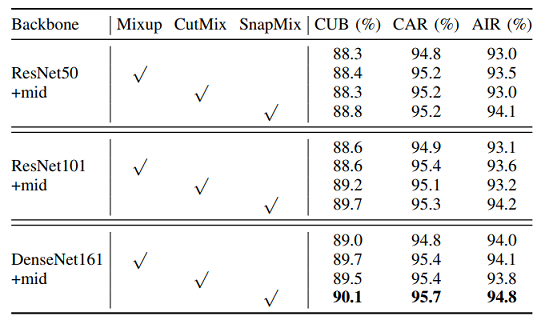

# Convolutional Fine-Grained Classification with Self-Supervised Target Relation Regularization
This is a Pytorch implementation of the paper [DTRG](https://arxiv.org/abs/2208.01997).
In this paper, we propose a novel non-parametric feature regularization to discover latent correlation across target classes in deep representation learning for visual classification, 
which is generic and can be readily adopted in existing classification methods.
Technically, we develop an online center loss to generate dynamic class-level representations, which are then utilized to construct a novel dynamic target relation graph. 
The proposed scheme can not only minimize intra-class feature variance but also capture inter-class correlation to encourage discriminative features.
Diverse inter-class target relation in the proposed DTRG can be further explored via semantic interpolation, as the mixup-style data augmentation.
Our method can beat recent comparative methods on popular benchmarks of multiple visual classification tasks, 
achieving the state-of-the-art accuracy on fine-grained object benchmarks and superior robustness against sparse and imbalanced data.
For more details, please refer to our [paper](https://arxiv.org/abs/2208.01997).
## Method Overview



## Setup
### Install Package Dependencies
```
torch torchvision
PyYAML easydict tqdm scikit-learn efficientnet_pytorch pandas opencv
```

## Datasets
### CUB-200-2011
Download CUB-200-2011 dataset from [this link](http://www.vision.caltech.edu/visipedia/CUB-200-2011.html) and move the uncompressed data folder to `./data/CUB-200-2011`. The data structure should be:

  ```
  ./data/CUB-200-2011
          └─── images.txt
          └─── image_class_labels.txt
          └─── train_test_split.txt
          └─── images
                  └─── 001.Black_footed_Albatross
                          └─── Black_Footed_Albatross_0001_796111.jpg
                          └─── ...
                  └─── 002.Laysan_Albatross
                  └─── ...
  ```
### Stanford Cars
Download Stanford Cars dataset from [this link](https://ai.stanford.edu/~jkrause/cars/car_dataset.html) and move the uncompressed data folder to `./data/stanford_cars`. The data structure should be:

  ```
  ./data/Standford_car
        └─── car_ims
                  └─── 00001.jpg
                  └─── 00002.jpg
                  └─── ...
        └─── cars_annos.mat
  ```


### FGVC-Aircraft
Download FGVC-Aircraft dataset from [this like](http://www.robots.ox.ac.uk/~vgg/data/fgvc-aircraft/) and move the uncompressed data folder to `./data/fgvc-aircraft-2013b`. The data structure should be:

  ```
  ./data/fgvc-aircraft-2013b
                  └─── images
                          └─── 0034309.jpg
                          └─── 0034958.jpg
                          └─── ...
                  └─── variants.txt
                  └─── images_variant_trainval.txt
                  └─── images_variant_test.txt
  ```
You can also change the data root in the `./datasets/xxx.py` for each dataset.

## Training & Evaluation

To train a model on CUB dataset using the Resnet50 backbone 

``` python main.py --dataset cub --netname resnet50 --seed 1 ```

``` python main.py --dataset cub --netname resnet50 --ocl --graph --seed 1 ```

To train a model on CUB dataset using the Resnet50+mid backbone 

``` python main.py --dataset cub --netname resnet50 --midlevel --seed 1 ```

``` python main.py --dataset cub --netname resnet50 --midlevel --ocl --graph --tau 2 --seed 1 ```

To train a model with inter-class relation augmentation on CUB dataset using the Resnet50+mid backbone 

``` python main.py --dataset cub --netname resnet50 --midlevel --mixmethod mixup --epochs 200 --ocl --graph --tau 2 --seed 1 ```

``` python main.py --dataset cub --netname resnet50 --midlevel --mixmethod cutmix --epochs 200 --ocl --graph --tau 2 --seed 1 ```

``` python main.py --dataset cub --netname resnet50 --midlevel --mixmethod snapmix --epochs 200 --ocl --graph --tau 2 --seed 1 ```

Compare with the Label Smooth, the OLS and the Center Loss methods on CUB dataset using the ResNet50 backbone.

``` python main.py --dataset cub --netname resnet50 --seed 1 --ls ```

``` python main.py --dataset cub --netname resnet50 --seed 1 --ols ```

``` python main.py --dataset cub --netname resnet50 --seed 1 --cl ```

To train model on other datasets using other network backbones, you can specify the following arguments: 

``` --netname: name of network architecture (for example: resnet50, resnet101, densenet161, ...) ```

``` --dataset: name of dataset  (for example: cub, car, aircrft, ...)```

## Performance
Ablation studies on CUB,  CAR and AIR datasets with ResNet50,  ResNet101, DenseNet161,ResNet50+mid, ResNet101+mid and DenseNet161+mid backbones, respectively.



Evaluation of the inter-class relation augmentation on the CUB, the CAR and the AIR datasets. Experiments are implemented with ResNet50+mid, the ResNet101+mid and DenseNet161+mid backbones, respectively.



## Citation

If you find our paper and repo useful, please cite our paper.
```commandline
@inproceedings{Liu2022ConvolutionalFC,
  title={Convolutional Fine-Grained Classification with Self-Supervised Target Relation Regularization},
  author={Kang-Jun Liu and Ke Chen and Kui Jia},
  journal={arXiv:2208.01997},
  year={2022}
}
```

## Acknowledgement
The structure of this codebase is borrowed from this pytorch implementataion of [SnapMix]( https://github.com/Shaoli-Huang/SnapMix).
